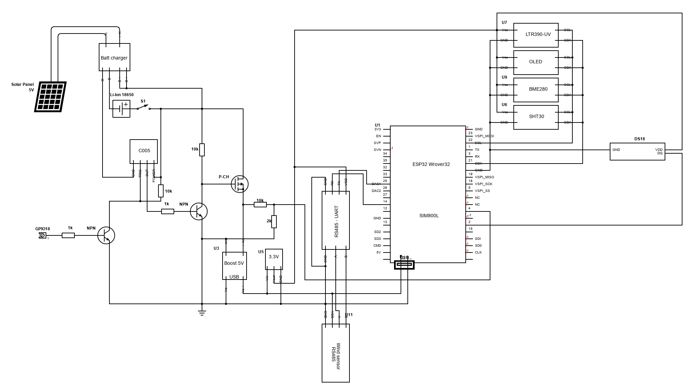

# Weather monitoring device

 
A remote weather monitoring device using the "Lilygo ESP32-SIM800L" board

Sensors used:

BME280 - Temperature, humidity and atmosferic pressure. 

SHT30 - Temperature and humidity. 

LTR390-UV -  Ultraviolet index.

RS485 Anemometer - Wind speed sensor with RS485 serial communication.

DS18B20 - Temperature

In order to be as more energy-efficient as possible, I have designed interval measurements by using an external cheap and effective timer (model C005). Another alternative was by using the board's deep-sleep functions but there was still current leakage from I2C ports. It would make the circuit more complex to deal with that issue. Board will power on periodically and will get command to power off from the board. This command can be given online as well, so it could stay powered on when required. 

MQTT is chosen as data transmitting protocol.. Data are published as JSON meesage payload. 

##Power circuit:

